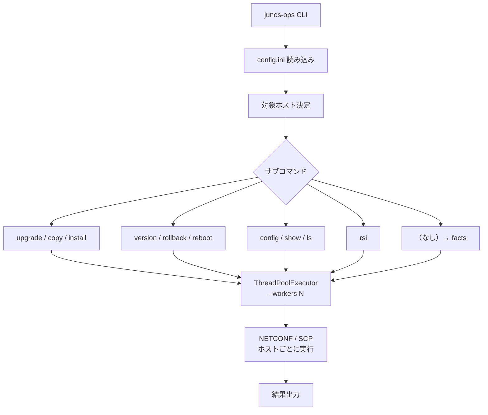
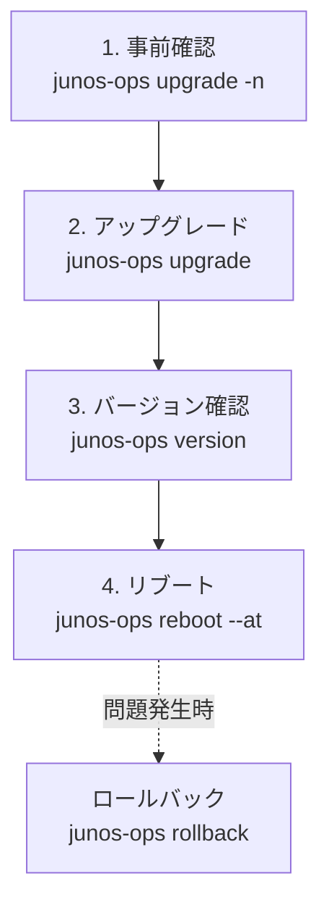
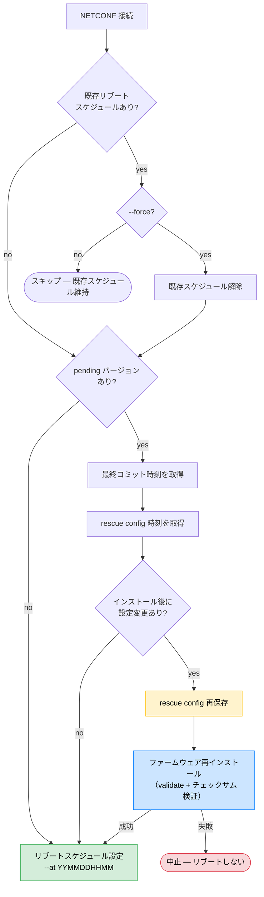

# junos-ops

[](https://pypi.org/project/junos-ops/)
[](https://github.com/shigechika/junos-ops/actions/workflows/ci.yml)
[](https://pypi.org/project/junos-ops/)

[English](https://github.com/shigechika/junos-ops/blob/main/README.md)

Juniper/JUNOS デバイスの運用を NETCONF 経由で自動化する Python CLI です。モデル自動検出付きの upgrade、rollback、reboot、config push、RSI/SCF 収集をサポートします。

> **RSI/SCF とは？** RSI = `request support information`（JTAC 向けサポート情報スナップショット）、SCF = `show configuration | display set`。収集したファイルはそれぞれ `.rsi` / `.scf` 拡張子で保存されるため、本ツールでも略号でそのまま扱っています。

## 特徴

- デバイスモデルの自動検出とパッケージの自動マッピング
- SCP 転送＋チェックサム検証による安全なパッケージコピー
- インストール前のパッケージ検証（validate）
- ロールバック対応（MX/EX/SRX モデル別処理）
- スケジュールリブート（ファームウェアインストール後の config 変更を自動検出し、必要なら再インストール）
- オンデマンドのリカバリスナップショット（`snapshot`）で代替ブートメディアを同期（MX 中心）、代替メディア稼働時の安全ガード付き
- RSI（request support information）/ SCF（show configuration | display set）の並列収集
- Pre-flight `check` サブコマンド: NETCONF 疎通・ローカル firmware チェックサム（デバイス接続不要）・リモート firmware チェックサムを 1 コマンドで統合表示
- 任意の CLI コマンドを複数ホストで実行（`show` サブコマンド、`RpcTimeoutError` 自動リトライ対応）
- `config` での設定投入（commit confirmed + コミット後ヘルスチェック: ping / `uptime` NETCONF プローブ / 任意の CLI コマンド）
- Jinja2 テンプレートによるホスト別設定生成（[詳細](docs/template.ja.md)）
- `--tags` によるタグベースのホストフィルタ（AND マッチ）
- ローカルファームウェア置き場（`lpath`、`~` 展開対応）
- ドライランモード（`--dry-run`）で事前確認
- 機械可読な JSON 出力（`--json`）で jq / 監視 / Ansible 連携
- ThreadPoolExecutor による並列実行（`--workers N`）
- 設定ファイル（INI 形式）によるホスト・パッケージ管理

## 目次

- [インストール](#インストール)
- [設定ファイル（config.ini）](#設定ファイルconfigini)
- [使い方](#使い方)
- [ワークフロー](#ワークフロー)
- [実行例](#実行例)
- [対応モデル](#対応モデル)
- [License](#license)

## インストール

### Homebrew (macOS)

```bash
brew install shigechika/tap/junos-ops
```

### Debian / Ubuntu (.deb)

Ubuntu 24.04 (Noble) 向けのパッケージを [GitHub Releases](https://github.com/shigechika/junos-ops/releases) で配布しています。`/opt/venvs/junos-ops/` に自己完結型の Python 仮想環境をインストールし、`/usr/bin/junos-ops` にシンボリックリンクを作成します。

```bash
sudo apt install ./junos-ops_*~noble.deb
```

### RHEL / Rocky Linux / AlmaLinux (.rpm)

RHEL/Rocky/AlmaLinux 9 向けのパッケージを [GitHub Releases](https://github.com/shigechika/junos-ops/releases) で配布しています。Python 3.12 が必要です。

```bash
sudo dnf install python3.12
sudo rpm -ivh junos-ops-*-1.el9.x86_64.rpm
```

### pip

```bash
pip install junos-ops
```

最新版に更新する場合:

```bash
pip install junos-ops --upgrade
```

### 開発用インストール

```bash
git clone https://github.com/shigechika/junos-ops.git
cd junos-ops
python3 -m venv .venv
. .venv/bin/activate
pip install -e ".[test]"
```

### 依存ライブラリ

- [junos-eznc (PyEZ)](https://www.juniper.net/documentation/product/us/en/junos-pyez) — Juniper NETCONF自動化ライブラリ
- [looseversion](https://pypi.org/project/looseversion/) — バージョン比較

### タブ補完（任意）

```bash
pip install junos-ops[completion]
eval "$(register-python-argcomplete junos-ops)"
```

`eval` の行を `~/.bashrc` や `~/.zshrc` に追記すると常時有効になります。

### pip3のインストール（未導入の場合）

<details>
<summary>OS別手順</summary>

- **Ubuntu/Debian**
  ```bash
  sudo apt install python3-pip
  ```

- **CentOS/RedHat**
  ```bash
  sudo dnf install python3-pip
  ```

- **macOS**
  ```bash
  brew install python3
  ```

</details>

## 設定ファイル（config.ini）

INI形式の設定ファイルで、接続情報とモデル別パッケージを定義します。

設定ファイルは以下の順序で探索されます（`-c` / `--config` で明示指定も可能）：

1. カレントディレクトリの `./config.ini`
2. `~/.config/junos-ops/config.ini`（XDG_CONFIG_HOME）

### ログ設定（logging.ini）

`logging.ini` を配置すると、ログ出力をカスタマイズできます（例: paramiko/ncclient の冗長なログを抑制）。`config.ini` と同じ順序で探索されます：

1. カレントディレクトリの `./logging.ini`
2. `~/.config/junos-ops/logging.ini`（XDG_CONFIG_HOME）

どちらも見つからない場合は、デフォルトのログ設定（INFO レベル、stdout 出力）が使用されます。

### DEFAULTセクション

全ホスト共通の接続設定とモデル→パッケージマッピングを記述します。

```ini
[DEFAULT]
id = exadmin          # SSHユーザ名
pw = password         # SSHパスワード
sshkey = id_ed25519   # SSH秘密鍵ファイル
port = 830            # NETCONFポート
hashalgo = md5        # チェックサムアルゴリズム
rpath = /var/tmp      # リモートパス
# ssh_config = ~/.ssh/config    # OpenSSH 互換設定（ProxyCommand 等）。未指定時は PyEZ が ~/.ssh/config を自動参照
# lpath = ~/firmware            # ローカルのファームウェア置き場（~ 展開対応、デフォルト: カレントディレクトリ）
# huge_tree = true    # 大きなXMLレスポンスを許可
# RSI_DIR = ./rsi/    # RSI/SCFファイルの出力先
# DISPLAY_STYLE = display set   # SCF出力形式（デフォルト: display set）
# DISPLAY_STYLE =               # 空にすると show configuration のみ（stanza形式）

# モデル名.file = パッケージファイル名
# モデル名.hash = チェックサム値
EX2300-24T.file = junos-arm-32-18.4R3-S10.tgz
EX2300-24T.hash = e233b31a0b9233bc4c56e89954839a8a
```

モデル名はデバイスから自動取得される`model`フィールドと一致させます。

### ホストセクション

各セクション名がホスト名になります。DEFAULTの値をホスト単位でオーバーライドできます。

```ini
[rt1.example.jp]             # セクション名がそのまま接続先ホスト名
tags = tokyo, core           # タグベースのホストフィルタリング（--tags）
[rt2.example.jp]
host = 192.0.2.1             # IPアドレスで接続先を指定
tags = osaka, core
[sw1.example.jp]
id = sw1                     # 接続ユーザを変更
sshkey = sw1_rsa             # SSH鍵を変更
ssh_config = ~/.ssh/config.lab   # ホスト別の OpenSSH 設定（bastion 等）
tags = tokyo, access
[sw2.example.jp]
port = 10830                 # ポートを変更
[sw3.example.jp]
EX4300-32F.file = jinstall-ex-4300-20.4R3.8-signed.tgz   # このホストだけ別バージョン
EX4300-32F.hash = 353a0dbd8ff6a088a593ec246f8de4f4
```

## 使い方

```
junos-ops <subcommand> [options] [hostname ...]
```

### サブコマンド一覧

| サブコマンド | 説明 |
|-------------|------|
| `upgrade [--unlink]` | コピー＋インストールを一括実行（`--unlink` は low-flash 機向け、後述） |
| `copy` | ローカルからリモートへパッケージをコピー |
| `install [--unlink]` | コピー済みパッケージをインストール（`--unlink` は low-flash 機向け、後述） |
| `rollback` | 前バージョンにロールバック |
| `version` | running/planning/pendingバージョンとリブート予定を表示 |
| `reboot --at YYMMDDHHMM` | 指定日時にリブートをスケジュール |
| `snapshot [--force]` | リカバリスナップショット（`request system snapshot`）を作成し代替ブートメディアを同期。MX 中心。代替メディアで稼働中のデバイスでは `--force` がない限り拒否。詳細は後述の [snapshot](#snapshotブートメディアの代替面を同期) を参照 |
| `ls [-l]` | リモートパスのファイル一覧 |
| `show COMMAND [--retry N]` / `show -f FILE` | 任意の CLI コマンド（またはコマンドファイル）を複数ホストで実行 |
| `check [--connect\|--local\|--remote\|--all] [--model M]` | Pre-flight チェック: NETCONF 疎通・ローカル/リモート firmware チェックサム |
| `config -f FILE` | set コマンドファイルを適用（`--confirm` / `--timeout` / `--no-confirm` / `--no-commit` / `--health-check` / `--no-health-check` の詳細は [docs/config.md](docs/config.md) を参照） |
| `rsi` | RSI/SCF を並列収集 |
| （なし） | デバイスファクト（device facts）を表示 |

### 共通オプション

| オプション | 説明 |
|-----------|------|
| `hostname` | 対象ホスト名（省略時は設定ファイル内の全ホスト） |
| `-c`, `--config CONFIG` | 設定ファイル指定（デフォルト: `config.ini` → `~/.config/junos-ops/config.ini`） |
| `-n`, `--dry-run` | テスト実行（接続とメッセージ出力のみ、実行しない） |
| `-d`, `--debug` | デバッグ出力 |
| `--force` | 条件を無視して強制実行 |
| `--json` | 人間向けテキストの代わりに機械可読 JSON を出力。ホストごとに 1 行の JSON オブジェクト（JSONL）。ログは stderr に退避されるため stdout は純粋な JSON のみ。`jq -s` で配列に slurp 可能。詳細は「JSON 出力」セクション参照 |
| `--tags TAG[,TAG...]` | タグでホストをフィルタ。カンマ区切りは 1 グループ内の AND、`--tags` の繰り返しはグループ間 OR。ホスト名併記時はタグフィルタと積集合。詳細は「タグベースのホストフィルタリング」セクション参照 |
| `--exclude-tags TAG[,TAG...]` | タグに一致するホストを除外。文法は `--tags` と同じ（カンマ区切り＝グループ内 AND、繰り返し＝グループ間 OR）。`--tags` 適用後にかかり、単独でも利用可（デフォルトの「全ホスト」集合から差し引く） |
| `--workers N` | 並列実行数（デフォルト: upgrade系=1, rsi=20） |
| `--version` | プログラムバージョン表示 |

### JSON 出力

任意のサブコマンドに `--json` を付けると機械可読出力が得られます。ホストごとに 1 行の JSON オブジェクト（JSON Lines / JSONL）を出力するため、`--workers N` での並列実行とも自然に組み合わせられます。

```console
$ junos-ops version --json rt1.example.jp rt2.example.jp
{"hostname": "rt1.example.jp", "ok": true, "model": "MX240", "running": "22.4R3-S6.5", ...}
{"hostname": "rt2.example.jp", "ok": true, "model": "EX2300-24T", "running": "22.4R3-S6.5", ...}
```

- ログ（`config` のコミット進捗を含む）および起動時の診断（設定ファイル読込失敗、対象ホスト 0 件）は **stderr** に出力されるため、`2>/dev/null` や stdout のみのパイプで純粋な JSON だけが得られます。起動失敗は終了コードで判定してください（その場合 stdout は空）。
- 接続失敗や実行中エラーのホストも 1 行を出力します（`{"hostname": ..., "ok": false, "error": ..., "error_message": ...}`）。consumer がホストの取りこぼしに気づけます。
- `jq -s` で 1 つの配列に集約: `junos-ops version --json | jq -s '.'`
- `check --json` は各行に `"check": "local"`（model 単位のインベントリ行）または `"check": "host"`（ホスト単位の行）を付与します。

## ワークフロー

### CLI 処理フロー

すべてのサブコマンドは共通の実行パイプラインを通ります。設定ファイルを読み込み、対象ホストを決定し（`--tags` で絞り込み可能）、`ThreadPoolExecutor` でホストごとにワーカースレッドへ振り分けます。`--workers N` で並列数を制御でき、upgrade 系はデフォルト 1（安全な逐次実行）、RSI 収集はデフォルト 20（I/O バウンドのため並列化が有効）です。各ワーカーは独立した NETCONF セッションを確立するため、ホスト間で状態を共有しません。



### JUNOS アップグレードワークフロー

ファームウェア更新はリスクを最小化する4ステップで構成されています。まず `dry-run` で接続性・パッケージの存在・チェックサムを変更なしで検証します。次に `upgrade` でコピーとインストールを実行します。`version` でインストール後の pending バージョンが想定通りか確認し、問題がなければリブートをスケジュールします。リブートを別ステップにしているのは、メンテナンスウィンドウを選択できるようにするためです。リブート前であればいつでも `rollback` で元のファームウェアに戻せます。



```
1. dry-run で事前確認
   junos-ops upgrade --dry-run hostname

2. upgrade でコピー＋インストール
   junos-ops upgrade hostname

3. version でバージョン確認
   junos-ops version hostname

4. reboot でリブート日時を指定
   junos-ops reboot --at 2506130500 hostname
```

問題が発生した場合は `rollback` で前バージョンに戻せます。

### upgrade 内部フロー

`upgrade` サブコマンドは更新前後に複数の安全チェックを行います。まず実行中バージョンと目標バージョンを比較し、一致していればスキップします。異なる pending バージョンが存在する場合は先にロールバックしてから進行します。コピーフェーズではディスク容量を確保（ストレージ cleanup + EX/QFX ではスナップショット削除）し、`safe_copy` でチェックサム検証付きの転送を行い破損を検出します。インストール前に既存のリブートスケジュールを解除し、rescue config を復旧基点として保存します。最後に `sw.install()` がデバイス上でパッケージの整合性を検証してから適用します。


### reboot 安全フロー

`reboot` はリブートスケジュール設定前に、ファームウェアインストール後に設定変更がなかったかを自動検出します。変更があった場合は rescue config を再保存し、validation 付きで再インストールを行い、新ファームウェアと現在の設定の互換性を確認します。



### config 適用ワークフロー

`config` サブコマンドは安全なコミットフローを採用しています。`commit confirmed`（自動ロールバックタイマー） → **ヘルスチェック** → `commit`（確定）の順に実行します。ヘルスチェックが失敗した場合、最終 `commit` を送信せず、タイマー満了時に JUNOS が自動的にロールバックします。

ヘルスチェック（`uptime`、ping、CLI コマンド）、commit confirmed フロー、`--no-confirm`、`--no-commit`、並列実行などの詳細は [docs/config.ja.md](docs/config.ja.md) を参照してください。

```
1. dry-run で差分を確認
   junos-ops config -f commands.set --dry-run hostname

2. 適用
   junos-ops config -f commands.set hostname

3. NETCONF ヘルスチェックで適用（ping 不要）
   junos-ops config -f commands.set --health-check uptime hostname
```

### タグベースのホストフィルタリング

`--tags` で `config.ini` に定義したタグによりホストを絞り込めます。2 種類の演算子を組み合わせて柔軟に選択できます。

- **グループ内は AND**: `--tags` の値をカンマ区切りにすると、そのすべてのタグを持つホストだけが対象になります（`--tags tokyo,core` → tokyo と core を**両方**持つホスト）。
- **グループ間は OR**: `--tags` を複数回指定するとそれぞれがグループになり、**いずれか**を満たせばマッチします（`--tags main --tags backup` → main か backup のどちらかを持つホスト）。
- **ホスト名併記は AND（積集合）**: 明示ホスト名と組み合わせた場合、タグで絞ったうえで名前リストとの積集合を取ります。「タグ条件を満たすホストのうち、さらに名前で絞り込む」動作です。

論理式で書くと `(--tags group₁) OR (--tags group₂) OR …` でホスト集合を絞り、ホスト名リストがあればさらに `AND` で交差させる形になります。`check` で bad だった数台だけを `--tags backup` の安全柵を残したまま再 copy する、といった使い方に向きます。

> **履歴:**
> v0.16.3 以前は `--tags` + ホスト名を和集合として扱っていました。v0.16.4 で積集合に変更し、`--tags` を「さらに名前で絞り込む」安全フィルタとして読ませています。v0.16.6 で `--tags` を繰り返し指定可能にしてグループ間 OR を追加しました（それ以前は argparse の仕様で最後の `--tags` しか効かず、黙って上書きされていました）。

```
# tokyo タグを持つ全ホスト
junos-ops version --tags tokyo

# tokyo AND core の両方のタグを持つホスト
junos-ops version --tags tokyo,core

# main または backup のどちらかのタグを持つホスト
junos-ops check --remote --tags main --tags backup

# (tokyo AND core) OR access — tokyo かつ core、または access タグを持つホスト
junos-ops version --tags tokyo,core --tags access

# backup タグを持つホストのうち、指定した 2 台だけを対象にする（タグフィルタ ∩ 名前リスト）
junos-ops copy --tags backup rt1.example.jp rt2.example.jp
```

#### `--exclude-tags` で除外する

`--exclude-tags` は `--tags` と同じ文法でホストを「落とす」フィルタです。`--tags` とホスト名による絞り込みが終わったあとに最終段として適用されます。

- `--exclude-tags a,b` は `a` と `b` を**両方**持つホストだけ落とします（グループ内 AND）。
- 繰り返し指定するとグループ間 OR になり、`--exclude-tags a --exclude-tags b` は `a` または `b` を持つホストを落とします。
- `--exclude-tags` は単独利用も可能です。`--tags` やホスト名指定が無いときはデフォルトの「全セクション」集合から差し引きます。
- すべてのホストが除外された場合は黙って no-op せずエラー終了します。

```
# main タグ持ちのうち SRX345 以外
junos-ops check --remote --tags main --exclude-tags srx345

# lab タグ以外の全ホスト
junos-ops version --exclude-tags lab

# main タグ持ちから SRX345 と EOL 機種を両方落とす（OR で除外）
junos-ops check --remote --tags main \
                --exclude-tags srx345 --exclude-tags eol
```

## 実行例

### upgrade（パッケージ更新）

```
% junos-ops upgrade rt1.example.jp
# rt1.example.jp
remote: jinstall-ppc-18.4R3-S10-signed.tgz is not found.
copy: system storage cleanup successful
rt1.example.jp: cleaning filesystem ...
rt1.example.jp: b'jinstall-ppc-18.4R3-S10-signed.tgz': 380102074 / 380102074 (100%)
rt1.example.jp: checksum check passed.
install: clear reboot schedule successful
install: rescue config save successful
rt1.example.jp: software validate package-result: 0
```

### version（バージョン確認）

```
% junos-ops version rt1.example.jp
# rt1.example.jp
  - hostname: rt1
  - model: MX5-T
  - running version: 18.4R3-S7.2
  - planning version: 18.4R3-S10
    - running='18.4R3-S7.2' < planning='18.4R3-S10'
  - pending version: 18.4R3-S10
    - running='18.4R3-S7.2' < pending='18.4R3-S10' : Please plan to reboot.
  - reboot requested by exadmin at Sat Dec  4 05:00:00 2021
```

### check（Pre-flight 検証）

NETCONF 疎通、ローカル/リモートの firmware チェックサムを 1 コマンドで一括検証します。1 件でも失敗すると終了コードが非ゼロになります。フラグ未指定時のデフォルトは `--connect` のみ。

`--local` は **インベントリモード** で、ホスト名は無視されます。`config.ini` に記載された `<model>.file` / `<model>.hash` のペアを列挙してステージングサーバー上のファイルを検証するので、NETCONF 接続は一切不要です:

```
% junos-ops check --local
lpath: /opt/firmware
model            file                                                        checksum
---------------  ----------------------------------------------------------  ----------
ex2300-24t       junos-arm-32-23.4R2-S7.4.tgz                                ok
ex3400-24t       junos-arm-32-23.4R2-S7.4.tgz                                ok(cached)
ex4300-32f       jinstall-ex-4300-21.4R3-S12.2-signed.tgz                    ok
mx5-t            jinstall-ppc-21.2R3-S8.5-signed.tgz                         missing

  mx5-t: - local package: /opt/firmware/jinstall-ppc-21.2R3-S8.5-signed.tgz is not found.
```

`--model M` で特定モデルだけに絞り込むことも可能です。複数モデルを一括で扱いたい場合は、`config.ini` の DEFAULT セクションに `<model>.tags = ...` を書いておき、`--tags`（および `--exclude-tags`）で絞り込めます。文法はホスト用の `--tags` と同じ（カンマ＝グループ内 AND、繰り返し＝グループ間 OR）ですが、セレクタは model 名そのもの **または** `<model>.tags` のいずれかに一致すれば採用されます。ホストの `tags` とは別空間で扱われます:

```ini
[DEFAULT]
ex2300-24t.file = junos-arm-32-23.4R2-S7.4.tgz
ex2300-24t.hash = ...
ex2300-24t.tags = main, edge       # optional model tags
mx240.file       = ...
mx240.tags       = backbone
```

```
# 単一モデル — model 名一致だけで動くので <model>.tags は不要
% junos-ops check --local --tags ex2300-24t

# main タグ付き model 群 — <model>.tags を見る
% junos-ops check --local --tags main

# model 名とタググループの OR
% junos-ops check --local --tags srx345 --tags backbone

# 結果から特定 model を落とす
% junos-ops check --local --tags main --exclude-tags ex3400-24t
```

`--local` 単独実行時は **ホスト側の `--tags`（ホストタグセレクタ）は適用されません**。`--local` はホスト非依存なので、`--tags` は上記の model セレクタに読み替えられます。`--local` を `--connect` / `--remote` と併用すると、後者のホスト単位処理では従来通りホストタグでの絞り込みが効きます。

> **`--all`（または `--local --connect`/`--remote`）での注意:** 1 つの `--tags` 値が両方のテーブルを同時に絞ります。インベントリ表は `<model>.tags`（および model 名）で、ホスト別表はホストタグで、です。2 つのタグ空間は独立しているので、`--all --tags main` で両方を一貫して絞りたいなら、model タグの `main` とホストタグの `main` の命名を揃えておいてください。

`--connect` / `--remote`（および `--all`）は **ホスト単位** で、指定されたホスト（または `config.ini` 内の全ホスト、`--tags` でフィルタ可能）に対して動作します。`--remote` は `copy` 完了後・`install` 前の「SCP が最後まで落ちたか」確認としても使えます:

```
% junos-ops check --connect --remote rt1.example.jp rt2.example.jp
hostname         connect  remote      model     file
---------------  -------  ----------  --------  -----------------------------------
rt1.example.jp   ok       ok          MX5-T     jinstall-ppc-18.4R3-S10-signed.tgz
rt2.example.jp   ok       missing     MX5-T     jinstall-ppc-18.4R3-S10-signed.tgz

  rt2.example.jp: remote: - remote package: jinstall-ppc-18.4R3-S10-signed.tgz is not found.
```

`--connect` / `--remote` でモデルが必要な場面では、`--model` 引数、`config.ini` の host セクションの `model = MX5-T` キー、デバイスから取得した `facts["model"]` の順にフォールバックします。

`--all` は両方のテーブルを順に出力します（先にインベントリ、次にホスト別）。

### rsi（RSI/SCF並列収集）

```
% junos-ops rsi --workers 5 rt1.example.jp rt2.example.jp
# rt1.example.jp
  rt1.example.jp.SCF done
  rt1.example.jp.RSI done
# rt2.example.jp
  rt2.example.jp.SCF done
  rt2.example.jp.RSI done
```

出力先は config.ini の `RSI_DIR` で指定しますが、`--rsi-dir DIR` で実行ごとに上書きできます（デフォルト: カレントディレクトリ）。

### reboot（スケジュールリブート）

```
% junos-ops reboot --at 2506130500 rt1.example.jp
# rt1.example.jp
	Shutdown at Fri Jun 13 05:00:00 2025. [pid 97978]
```

### snapshot（ブートメディアの代替面を同期）

```
% junos-ops snapshot rt1.example.jp
# rt1.example.jp
	snapshot: 'request system snapshot' completed
```

`request system snapshot` を実行し、稼働中システム（root ＋ config）を**代替（バックアップ）ブートメディア**へコピーします。

JUNOS のアップグレードは現在稼働中のメディアしか書き換えず、代替面は自動更新されないため時間とともに古くなります（「化石化した代替面」）。後にプライマリがブートに失敗すると、デバイスはその古い代替面にフォールバックし、疎通できない状態で立ち上がることがあります。リスクの高い変更の前や定期的にスナップショットを取っておくと、代替面が最新に保たれフォールバックが安全になります。

- **MX が主対象**（固定構成の MX5/MX80 デュアル eUSB、および RE/ディスクベースの MX240/480）。この問題が実際に表面化するプラットフォームです。
- **EX/QFX（SWITCH）** は対応していますが、EX2300/EX3400 は慢性的に空き容量が逼迫しておりリカバリスナップショットが収まらない場合があります。容量不足は致命的エラーではなく、クリーンな「スキップ」として報告されます。
- **Branch SRX（SRX300/320/340/345/380）** は対応していますが**優先度は低め**です。通常のアップグレード時に代替スライスが同期されるため、明示的なスナップショットは通常不要です（`request system snapshot slice alternate` を使用）。
- その他のプラットフォーム（MX204/MX10003 等の vmhost MX、mid/high-end SRX、HA クラスタ、vMX/vSRX、Junos Evolved、不明機種）は**スキップ**されます（非致命的）。スナップショット挙動が未検証のハードウェアにはコマンドを発行しません。

**安全ガード:** `snapshot` は、代替メディアで稼働中と判定されるデバイス上では実行を拒否します（古い可能性のあるシステムをプライマリへ複製してしまうのを防ぐため）。稼働中イメージこそ伝播させたいものだと確信できる場合のみ `--force` で上書きしてください。代替メディア稼働状態のオンデバイス判定はベストエフォートで、「判定不能（inconclusive）」を報告することがあります（その場合は警告付きでスナップショットを続行します）。

### config（set コマンドファイル適用）

set 形式のコマンドファイルを複数デバイスに適用します。commit check → commit confirmed → confirm の安全なコミットフローで実行します。

```
% cat add-user.set
set system login user viewer class read-only
set system login user viewer authentication ssh-ed25519 "ssh-ed25519 AAAA..."

% junos-ops config -f add-user.set --dry-run rt1.example.jp rt2.example.jp
# rt1.example.jp
[edit system login]
+    user viewer {
+        class read-only;
+        authentication {
+            ssh-ed25519 "ssh-ed25519 AAAA...";
+        }
+    }
	dry-run: rollback (no commit)
# rt2.example.jp
	...

% junos-ops config -f add-user.set rt1.example.jp rt2.example.jp
# rt1.example.jp
	...
	commit check passed
	commit confirmed 1 applied
	health check: uptime (NETCONF RPC)
	health check passed (uptime: 2026-04-16 13:20:31 JST)
	commit confirmed, changes are now permanent
# rt2.example.jp
	...
```

`--confirm N` で commit confirmed のタイムアウトを変更できます（デフォルト: 1分）。`--no-health-check` でコミット後のヘルスチェックをスキップできます。

set ファイルには `#` コメント行や空行を含めることができます。適用前に自動的に除去されます。

#### Jinja2 テンプレート

`.j2` ファイルを使って、1つのテンプレートからホストごとに異なる設定を生成できます。変数は config.ini の `var_*` キーとデバイスファクトから取得されます。

```bash
junos-ops config -f ntp.set.j2 --dry-run rt1.example.jp sw1.example.jp
junos-ops config -f ntp.set.j2 rt1.example.jp sw1.example.jp
```

条件分岐やループなど詳しい使い方は [docs/template.ja.md](docs/template.ja.md) を参照してください。

### show（CLI コマンド実行）

任意の CLI コマンドを複数デバイスに対して並列実行します。`--retry N` で `RpcTimeoutError` 発生時に自動リトライできます（大量ホストへの一括実行時に有効）。

```
% junos-ops show "show bgp summary" --config accounts.ini gw1.example.jp gw2.example.jp
# gw1.example.jp
Groups: 4 Peers: 6 Down peers: 0
...
# gw2.example.jp
Groups: 3 Peers: 4 Down peers: 0
...
```

`-f` でファイルから複数コマンドを読み込み、デバイスごとに1つの NETCONF セッション内で順次実行します。

```
% cat commands.txt
# セキュリティポリシー確認
show security policies hit-count
show security flow session summary

% junos-ops show -f commands.txt --config accounts.ini fw1.example.jp
# fw1.example.jp
## show security policies hit-count
...

## show security flow session summary
...
```

`--retry N` で `RpcTimeoutError` 時に自動リトライします（バックオフ: 5秒, 10秒, 15秒, ...）:

```
% junos-ops show "show system alarms" --retry 2 --workers 10 --config accounts.ini
```

#### 構造化出力（`--format`）

`-F` / `--format {text,json,xml}` で出力形式を切り替えられます。`text` が既定（従来動作）、`json` はプログラム／AI アシスタント向け、`xml` は RPC 応答を pretty-print して返します。

```
% junos-ops show "show interfaces terse" --format json gw1.example.jp
# gw1.example.jp
## show interfaces terse
{
  "interface-information": {
    "physical-interface": [ ... ]
  }
}
```

> **注意 — `json` / `xml` ではパイプ段が落ちる。** NETCONF 経由で `json`／`xml` を要求すると、`| match`、`| last`、`| count` などのパイプ修飾子はデバイス側で暗黙に落とされます（[Juniper/junos-mcp-server#4](https://github.com/Juniper/junos-mcp-server/issues/4)／[#12](https://github.com/Juniper/junos-mcp-server/issues/12) 参照）。`--format text` なら従来どおりパイプ段は有効です。構造化出力をフィルタしたいときは `text` のままシェル側（`jc` / `grep` / 後段の `jq` 等）で加工するか、対応する RPC を直接呼び出してください。

### 引数なし（デバイスファクト表示）

```
% junos-ops gw1.example.jp
# gw1.example.jp
{'2RE': True,
 'hostname': 'gw1',
 'model': 'MX240',
 'version': '18.4R3-S7.2',
 ...}
```

## 低容量機種での upgrade (`--unlink`)

EX2300/EX3400 のような low-flash 機種（`/dev/gpt/junos` = 1.3GB）で 22.4 系から 23.4 系への major アップグレードを行うと、`software validate package-result: 1` 段階で `ERROR: insufficient space` が出て失敗することがあります。これは PyEZ `SW.install()` が `request system software add` の `unlink` オプションをパラメータとして公開しておらず、デフォルト経路では pkgadd に unlink を指示できないため、元の tgz が展開中ずっと容量を占有するためです。

`--unlink` を指定すると CLI 経由で `request system software add <package> unlink` を直接実行し、pkgadd が tgz を install 中に unlink して容量を確保しながら展開します。

```bash
# low-flash 機種向け
junos-ops upgrade --unlink ex3400-host.example.jp

# install のみのモードにも適用可能
junos-ops install --unlink ex3400-host.example.jp
```

## 対応モデル

設定ファイルでモデル名とパッケージファイルを定義することで、任意のJuniperモデルに対応できます。設定例に含まれるモデル:

| シリーズ | モデル例 |
|---------|---------|
| EX | EX2300-24T, EX3400-24T, EX4300-32F |
| MX | MX5-T, MX240 |
| QFX | QFX5110-48S-4C |
| SRX | SRX300, SRX345, SRX1500, SRX4600 |

## License

[Apache License 2.0](LICENSE)

Copyright 2022-2025 AIKAWA Shigechika
