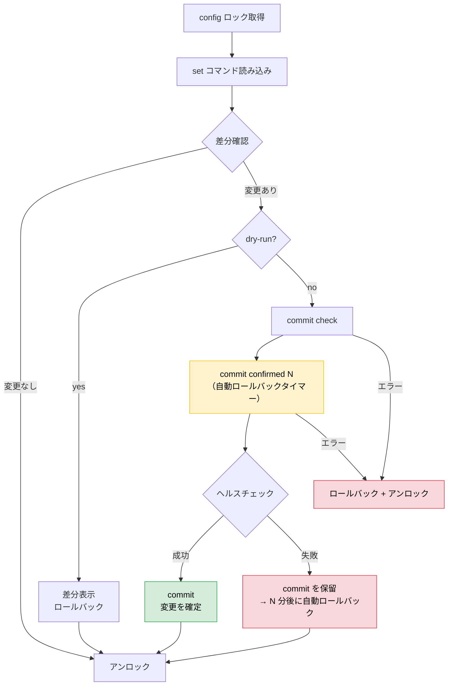

# config サブコマンド

[English](config.md) | [Jinja2 テンプレート](template.ja.md)

`config` サブコマンドは set 形式のコマンドファイルを Juniper デバイスに適用します。commit confirmed（失敗時の自動ロールバック）、ヘルスチェック、Jinja2 テンプレート、並列実行に対応しています。

## 基本的な使い方

```bash
# 差分を確認（dry-run）
junos-ops config -f commands.set --dry-run rt1.example.jp

# 複数デバイスに適用
junos-ops config -f commands.set rt1.example.jp rt2.example.jp

# config.ini の全ホストに適用
junos-ops config -f commands.set

# タグで絞り込んで適用
junos-ops config -f commands.set --tags tokyo,core
```

## set コマンドファイル

`.set` ファイルには Junos の set 形式コマンドを1行1コマンドで記述します。`#` コメント行と空行は自動的に除去されます。

```
# NTP 設定
set system ntp server 192.0.2.1

# Syslog
set system syslog host 192.0.2.2 any warning
set system syslog host 192.0.2.2 authorization info
```

### Jinja2 テンプレート

`.j2` ファイルを使ってホストごとに異なる設定を生成できます。詳しくは [template.ja.md](template.ja.md) を参照してください。

```bash
junos-ops config -f ntp.set.j2 --dry-run rt1.example.jp sw1.example.jp
```

## コミットフロー

デフォルトのコミットフローは commit confirmed を使い、設定ミスで接続が切れた場合に自動ロールバックで保護します。



### commit confirmed の仕組み

1. **`commit confirmed N`** でタイマー付きの設定適用（デフォルト: 1分）
2. タイマー満了までに `commit` が送信されなければ、JUNOS が自動ロールバック
3. ヘルスチェック成功後に最終 `commit` を送信して変更を確定
4. ヘルスチェック失敗時は最終 `commit` を送信しない → JUNOS が自動ロールバック

設定変更で NETCONF 接続が切れた場合でも、デバイスが自動的に復旧します。

## オプション

| オプション | 説明 |
|-----------|------|
| `-f FILE` | set コマンドファイルまたは Jinja2 テンプレート（`.j2`）を指定（必須） |
| `--dry-run`, `-n` | 差分表示のみ（コミットしない） |
| `--confirm N` | commit confirmed のタイムアウト（分、デフォルト: 1） |
| `--health-check CMD` | ヘルスチェックコマンド（複数指定可、後述） |
| `--no-health-check` | ヘルスチェックをスキップ |
| `--timeout N` | RPC タイムアウト（秒、デフォルト: 120、config.ini の `timeout` でも設定可能） |
| `--no-confirm` | commit confirmed とヘルスチェックをスキップし直接 commit |
| `--workers N` | 並列実行数（デフォルト: 1） |

## ヘルスチェック

`commit confirmed` 後にデバイスの到達性を確認します。チェック失敗時は最終 `commit` を送信せず、JUNOS が自動ロールバックします。

### ヘルスチェックの種類

| 種類 | 指定方法 | 成功条件 |
|------|---------|---------|
| **NETCONF uptime プローブ** | `--health-check uptime` | NETCONF RPC で有効な uptime データが返ること（ICMP 不要） |
| **ping** | `--health-check "ping count 3 192.0.2.1 rapid"` | `N packets received` の N > 0 |
| **CLI コマンド** | `--health-check "show system uptime"` | 例外なくコマンドが実行できること |

### デフォルト

`--health-check` 未指定時は `ping count 3 255.255.255.255 rapid` がデフォルトです。ICMP が使えない環境では `--health-check uptime` を使用してください。

### フォールバック（複数指定）

`--health-check` を複数指定すると順番に試行します。1つでも成功すれば通過し、全コマンドが失敗した場合のみロールバックとなります。

```bash
# NETCONF プローブを先に試行、失敗したら ping にフォールバック
junos-ops config -f commands.set \
  --health-check uptime \
  --health-check "ping count 3 192.0.2.1 rapid" \
  rt1.example.jp

# 2つの ping 先を試行
junos-ops config -f commands.set \
  --health-check "ping count 3 192.0.2.1 rapid" \
  --health-check "ping count 3 ::1 rapid" \
  rt1.example.jp
```

### ヘルスチェックのスキップ

```bash
junos-ops config -f commands.set --no-health-check rt1.example.jp
```

## 直接コミット（--no-confirm）

commit confirmed / ヘルスチェックのフローをスキップして直接 commit します。commit confirmed が遅いデバイス（SRX3xx 等）で有用です。

```bash
junos-ops config -f commands.set --no-confirm rt1.example.jp
```

> **注意:** commit confirmed なしでは自動ロールバックの安全ネットがありません。慎重に使用してください。

## 並列実行

`--workers N` で複数デバイスへの設定適用を並列化できます。各ワーカーは独立した NETCONF セッションを確立します。

```bash
# 5台に並列適用
junos-ops config -f commands.set --workers 5
```

## 実行例

### 確認と適用

```bash
# 差分を確認
junos-ops config -f add-user.set --dry-run rt1.example.jp rt2.example.jp

# 適用
junos-ops config -f add-user.set rt1.example.jp rt2.example.jp
```

### NETCONF ヘルスチェック（ping 不要）

```bash
junos-ops config -f commands.set --health-check uptime rt1.example.jp
```

### confirm タイムアウトの変更

```bash
# 3分のロールバックタイマー
junos-ops config -f commands.set --confirm 3 rt1.example.jp
```

### RPC タイムアウトの変更

```bash
# 応答の遅いデバイス向けに300秒
junos-ops config -f commands.set --timeout 300 rt1.example.jp
```
