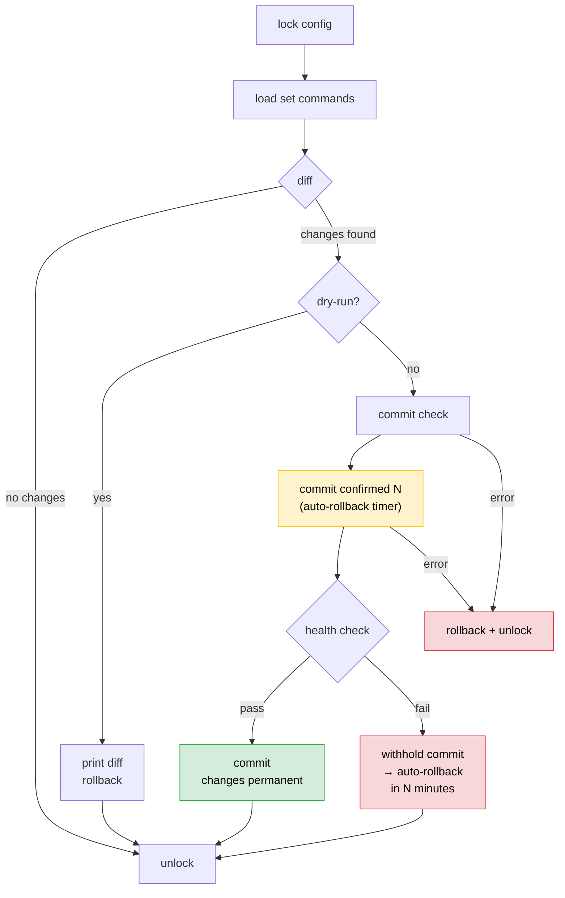

# Config Subcommand

[日本語版 / Japanese](config.ja.md) | [Jinja2 Templates](template.md)

The `config` subcommand pushes set-format command files to Juniper devices with a safe commit flow. It supports commit confirmed (auto-rollback on failure), health checks, Jinja2 templates, and parallel execution.

## Basic Usage

```bash
# Preview changes
junos-ops config -f commands.set --dry-run rt1.example.jp

# Apply to multiple devices
junos-ops config -f commands.set rt1.example.jp rt2.example.jp

# Apply to all hosts in config.ini
junos-ops config -f commands.set

# Apply to tagged hosts
junos-ops config -f commands.set --tags tokyo,core
```

## Set Command Files

A `.set` file contains Junos set-format configuration commands, one per line. Comments (`#`) and blank lines are automatically stripped.

```
# NTP configuration
set system ntp server 192.0.2.1

# Syslog
set system syslog host 192.0.2.2 any warning
set system syslog host 192.0.2.2 authorization info
```

### Jinja2 Templates

Use `.j2` files to generate per-host configurations from a single template. See [template.md](template.md) for details.

```bash
junos-ops config -f ntp.set.j2 --dry-run rt1.example.jp sw1.example.jp
```

## Commit Flow

The default commit flow uses commit confirmed with an auto-rollback timer to protect against configuration errors that break connectivity.



### How commit confirmed works

1. **`commit confirmed N`** applies the configuration with a timer (default: 1 minute)
2. If the timer expires without a follow-up `commit`, JUNOS automatically rolls back
3. After the health check passes, a final `commit` is sent to make changes permanent
4. If the health check fails, the final `commit` is withheld — JUNOS auto-rolls back

This means even if a configuration change breaks NETCONF connectivity, the device recovers automatically.

## Options

| Option | Description |
|--------|-------------|
| `-f FILE` | Set command file or Jinja2 template (`.j2`) to apply (required) |
| `--dry-run`, `-n` | Show diff without committing |
| `--confirm N` | Commit confirmed timeout in minutes (default: 1) |
| `--health-check CMD` | Health check command (repeatable, see below) |
| `--no-health-check` | Skip health check after commit confirmed |
| `--timeout N` | RPC timeout in seconds (default: 120, also configurable via `timeout` in config.ini) |
| `--no-confirm` | Skip commit confirmed and health check, commit directly |
| `--workers N` | Parallel execution (default: 1) |

## Health Check

After `commit confirmed`, a health check verifies that the device is still reachable. If the check fails, the final `commit` is not sent and JUNOS auto-rolls back.

### Health check types

| Type | Syntax | Success criteria |
|------|--------|-----------------|
| **NETCONF uptime probe** | `--health-check uptime` | Device responds with valid uptime data via NETCONF RPC (no ICMP dependency) |
| **ping** | `--health-check "ping count 3 192.0.2.1 rapid"` | `N packets received` where N > 0 |
| **CLI command** | `--health-check "show system uptime"` | Command executes without exception |

### Default

If `--health-check` is not specified, the default is `uptime` (NETCONF RPC probe). It uses the existing NETCONF session so it does not depend on ICMP reachability, and confirms that commit confirmed left the management plane responsive.

### Fallback (multiple health checks)

Multiple `--health-check` options are tried in order. The check passes as soon as one succeeds. It fails only if all commands fail.

```bash
# Try NETCONF probe first, fall back to ping
junos-ops config -f commands.set \
  --health-check uptime \
  --health-check "ping count 3 192.0.2.1 rapid" \
  rt1.example.jp

# Try two different ping targets
junos-ops config -f commands.set \
  --health-check "ping count 3 192.0.2.1 rapid" \
  --health-check "ping count 3 ::1 rapid" \
  rt1.example.jp
```

### Skipping health check

```bash
junos-ops config -f commands.set --no-health-check rt1.example.jp
```

## Direct Commit (--no-confirm)

Skip the commit confirmed / health check flow and commit directly. Useful for devices where commit confirmed is too slow (e.g., SRX3xx series).

```bash
junos-ops config -f commands.set --no-confirm rt1.example.jp
```

> **Warning:** Without commit confirmed, there is no automatic rollback safety net. Use with caution.

## Parallel Execution

Use `--workers N` to push configurations to multiple devices in parallel. Each worker establishes its own NETCONF session.

```bash
# Push to 5 devices in parallel
junos-ops config -f commands.set --workers 5
```

## Examples

### Preview and apply

```bash
# Preview changes
junos-ops config -f add-user.set --dry-run rt1.example.jp rt2.example.jp

# Apply
junos-ops config -f add-user.set rt1.example.jp rt2.example.jp
```

### With NETCONF health check (no ping dependency)

```bash
junos-ops config -f commands.set --health-check uptime rt1.example.jp
```

### With custom confirm timeout

```bash
# 3-minute rollback timer
junos-ops config -f commands.set --confirm 3 rt1.example.jp
```

### With RPC timeout

```bash
# 300-second RPC timeout for slow devices
junos-ops config -f commands.set --timeout 300 rt1.example.jp
```

